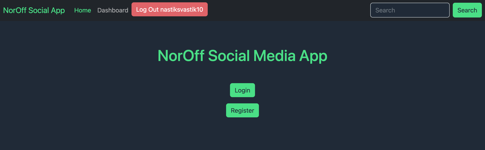

# [NorOff Javascript 2 Course Assignment] | [Front-End Development 2 year]



[Project plan in Trello](https://trello.com/invite/b/IiYfKAsm/ATTIee7157dd1f9617e65a72ab4292a95c7f69986830/js2-ca)

## Goal

Using the provided API and API documentation, create a functioning user interface that allows for viewing, posting, editing and deleting social media content.

Social API routes require authorisation via JWT (JSON Web Tokens). You will need to register an account and login to access your token.

To complete the required features, you will also need to make use of GET, POST, PUT, and DELETE HTTP methods.

Using localStorage is highly recommended, especially for storing JWT tokens.

A finished project fulfils the requirements below with an easy to use and error-free user interface.

## Description

The goal of the Javascript 2 Course Assignment is to show student's Javascript techniques to implement the front-end functionality for a social media application.

Using provided NorOff API and API documentation, I have been tasked to create a functioning user interface that allows for viewing, posting, editing and deleting social media content.

I used CRUD methods to get, post, put and delete posts.
JWT was also used to get access token which then was stored in local storage.

Javascript functions description was made using JSDocs.

## Built With

- HTML
- CSS
- Sass
- JavaScript
- [NorOff API](https://docs.noroff.dev/)

## Getting Started

### Installing

1. Clone the repo:

```bash
git clone git@github.com:anasommer/js2-ca.git
```

### Running

Start a Live Server to see my project.

## Contact

[My Portolio Page](https://www.anasommer.com/)

[My LinkedIn Page](https://www.linkedin.com/in/anastassia-sommer-146409235/)
